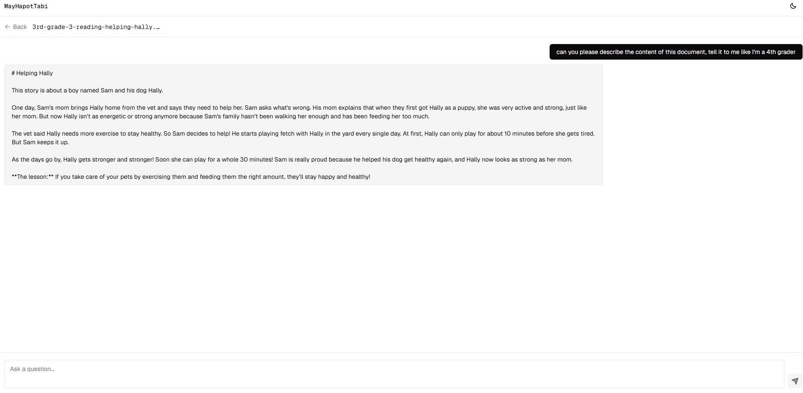
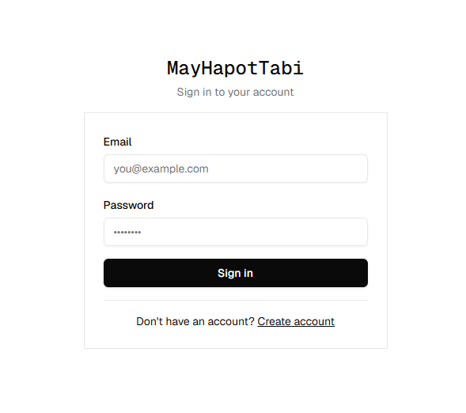
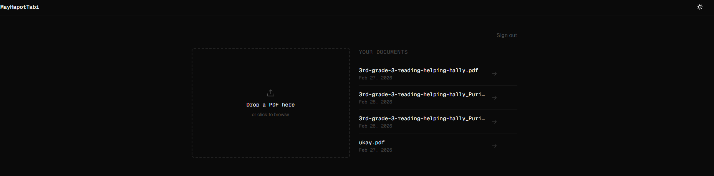
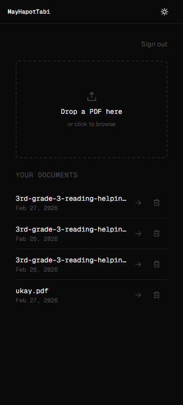

# MayHapotTabi

> *"May hapot tabi"* — Bicolano for *"I have a question."*
> Ask anything. From any document.

**Live demo → https://may-hapot-tabi.vercel.app**


---

## What it does

MayHapotTabi lets you upload a PDF and have a real conversation with it.
Ask questions, get answers grounded in the actual document content —
not hallucinated, not generic. Built as a portfolio project to demonstrate
a production RAG pipeline from scratch.

---

## Tech stack

**Frontend**
- React + Vite + TypeScript
- Tailwind CSS + shadcn/ui
- Supabase Auth (email/password)
- Deployed on Vercel

**Backend**
- Node.js + Express + TypeScript
- Dockerized, deployed on Railway
- PDF parsing with pdf-parse
- Embeddings via Voyage AI (voyage-3, 1024 dimensions)
- Vector similarity search via Supabase pgvector
- Streaming chat responses via Anthropic API (claude-haiku)

**Database & Storage**
- Supabase (PostgreSQL + pgvector + Storage)
- Row Level Security — users only access their own documents

**DevOps**
- Docker multi-stage build
- GitHub Actions CI (TypeScript build check on every push)
- Railway auto-deploy on push to main

---

## How it works

```
Upload PDF → extract text → chunk into ~400 token segments
→ embed each chunk via Voyage AI → store vectors in pgvector

Ask question → embed question → cosine similarity search
→ retrieve top 5 relevant chunks → send as context to Claude
→ stream response token by token back to the browser
```

This is a full RAG (Retrieval-Augmented Generation) pipeline —
the model only answers from your document, not from general knowledge.

---

## Features

- PDF upload with drag and drop
- Real-time streaming chat responses
- Conversation history maintained per session
- Per-user document isolation via Supabase RLS
- Document deletion with inline confirmation
- Light and dark mode
- Mobile responsive
- Graceful error handling (scanned PDFs, empty results, network failures)

---

## Running locally

**Prerequisites:** Node.js 20+, Docker, Supabase account,
Anthropic API key, Voyage AI API key

**1. Clone the repo**
```bash
git clone https://github.com/KMercad0/MayHapotTabi
cd MayHapotTabi
```

**2. Set up Supabase**
- Create a new Supabase project
- Run the SQL schema from `PLANNING.md` in the Supabase SQL editor
- Create a storage bucket named `uploads` (private)
- Enable pgvector extension

**3. Backend**
```bash
cd backend
cp .env.example .env
# fill in your keys
npm install
npm run dev
```

**4. Frontend**
```bash
cd frontend
cp .env.example .env.local
# fill in your Supabase URL and anon key
npm install
npm run dev
```

App runs at http://localhost:5173

---

## Environment variables

**Backend `.env`**
```
PORT=3000
SUPABASE_URL=
SUPABASE_SERVICE_ROLE_KEY=
ANTHROPIC_API_KEY=
VOYAGE_API_KEY=
FRONTEND_URL=
```

**Frontend `.env.local`**
```
VITE_SUPABASE_URL=
VITE_SUPABASE_ANON_KEY=
VITE_BACKEND_URL=
```

---

## Project structure

```
mayhapottabi/
├── frontend/          # React + Vite → Vercel
├── backend/           # Express + Docker → Railway
├── PLANNING.md        # Full architecture and build log
└── .github/workflows/ # CI pipeline
```

---

Built by [Karl Mercado](https://github.com/KMercad0)


